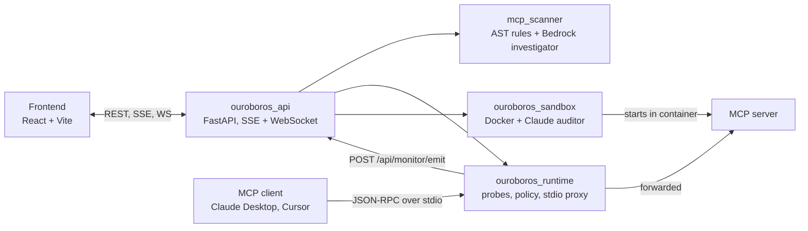

# Ouroboros

**Find vulnerabilities in MCP servers before, during, and after they run.**

Ouroboros is a security toolkit for Model Context Protocol servers and the AI agents that call them. It scans server source code for known attack patterns, sits between an MCP client and server to check traffic as it flows, and drives a Claude agent that attacks a server inside a Docker container to see what actually breaks. A FastAPI backend ties the three together and a React dashboard shows the results live.

## What it does

- **Static scanning.** `mcp_scanner` walks a Python codebase, parses every file with `ast`, and pulls out `@mcp.tool` and `@mcp.resource` registrations. Ten rules check for tool poisoning, prompt injection, command injection, token leakage, rug pulls, tool shadowing, excessive permissions, code execution, indirect injection, and multi-vector servers. It never imports or runs the target code. An optional `investigate` step hands the findings to Claude on AWS Bedrock, which reads the code with a small set of tools and writes an attack narrative.
- **Runtime checks.** `ouroboros_runtime` probes URLs and MCP responses: TLS certificate, security headers, redirect chains, prompt-injection patterns, hidden text, and canary tokens for exfiltration. Google Safe Browsing and VirusTotal are used when their API keys are set. A stdio proxy wraps any MCP server command, runs every response through the probes, and applies a YAML policy that blocks, warns, or logs per rule. Verdicts are SAFE, CAUTION, or BLOCK.
- **Sandbox audits.** `ouroboros_sandbox` copies a server into a Docker container, starts it, connects over stdio, and lets a Claude agent call its tools with adversarial inputs: path traversal, command injection, SSRF, and the like. Tool names and descriptions are risk-scored first so the agent spends its iteration budget on the dangerous ones. Static and dynamic findings are merged into one report.
- **A dashboard.** `Ouroboros_frontend` has three modes. Monitor shows proxied MCP calls arriving over a WebSocket. Scan runs the runtime probes against a URL and streams each probe result. Sandbox starts an audit from a local path or GitHub URL and streams container logs, agent reasoning, and the final findings table.

## How it works



Each package is also a standalone CLI. The API wraps them in background jobs, keeps results in memory, and streams progress to the browser. The proxy is the only piece that runs inside someone else's process tree: an MCP client launches it in place of the real server, and it launches the real server as a child.

The internals of every probe, rule, and agent loop are written up in [BACKEND_DEEP_DIVE.md](./BACKEND_DEEP_DIVE.md).

## Quick start

You need Python 3.10+, Node 18+, Docker for sandbox audits, and AWS credentials with Bedrock access for anything that uses Claude.

**1. Backend**

```bash
python3 -m venv .venv && .venv/bin/pip install -r requirements.txt
.venv/bin/python -m uvicorn ouroboros_api.main:app --port 8000
```

**2. Frontend**

```bash
cd Ouroboros_frontend
npm install
VITE_USE_REAL_API=true npm run dev          # http://localhost:8080
```

Without `VITE_USE_REAL_API` the UI runs on mock data and needs no backend.

**3. Use the CLIs directly**

```bash
# static scan of a server directory
python -m mcp_scanner scan ./my-mcp-server
python -m mcp_scanner scan ./my-mcp-server --format json -o report.json
python -m mcp_scanner investigate ./my-mcp-server --max-iterations 15

# runtime probes against a URL
python -m ouroboros_runtime scan https://example.com
python -m ouroboros_runtime check-policy policy.yaml

# wrap an MCP server in the proxy
python -m ouroboros_runtime proxy --stdio -- python -m my_server

# sandbox audit of a local server
python -m ouroboros_sandbox check-docker
python -m ouroboros_sandbox audit ./my-mcp-server --start "python -m server" -o report.md
```

To watch real traffic in the Monitor tab, point your MCP client at the proxy instead of the server. For Claude Desktop that is `~/Library/Application Support/Claude/claude_desktop_config.json` on macOS:

```json
{
  "mcpServers": {
    "my-server": {
      "command": "python",
      "args": ["-m", "ouroboros_runtime", "proxy", "--stdio", "--", "python", "-m", "my_server"]
    }
  }
}
```

The proxy posts each call to `http://localhost:8000/api/monitor/emit`, and the dashboard reads them from `/api/monitor/ws`.

## Configuration

All settings are environment variables. None are required for static scanning or the mock-data UI.

| Variable | Used by | Purpose |
|----------|---------|---------|
| `AWS_ACCESS_KEY_ID`, `AWS_SECRET_ACCESS_KEY`, `AWS_PROFILE` | scanner investigate, sandbox, API | Standard boto3 credentials for Bedrock. The API reports Bedrock as available when any of these or `ANTHROPIC_API_KEY` is set. |
| `ANTHROPIC_API_KEY` | sandbox | If it starts with `ABSK` it is treated as a Bedrock API key and exported as `AWS_BEARER_TOKEN_BEDROCK`. |
| `GOOGLE_SAFE_BROWSING_API_KEY` | runtime | Enables the Safe Browsing probe. Unset disables it. |
| `VIRUSTOTAL_API_KEY` | runtime | Enables the VirusTotal probe. Unset disables it. |
| `VITE_USE_REAL_API` | frontend | `true` talks to the backend. Anything else uses mock hooks. |
| `VITE_API_URL` | frontend | Backend origin (default `http://localhost:8000`). |
| `DVMCP_PATH` | tests | Local checkout of Damn Vulnerable MCP Server. If unset the test clones it. |

The Bedrock model defaults to `us.anthropic.claude-sonnet-4-20250514-v1:0` in `us-east-1`. Both CLIs take `--region`, and `mcp_scanner investigate` takes `--model`.

Runtime enforcement is a YAML file passed with `--policy`. The default, in `ouroboros_runtime/policy/defaults.yaml`, blocks response injection, exfiltration signals, redirect spoofing, TLS failures, cross-tool exfiltration, and MCP payload injection; warns on malicious content, schema drift, and behavioral inconsistency; and logs header problems. Actions are `block`, `warn`, `log`, or `skip`, with optional per-domain overrides under `allowlist`.

## Project layout

```
mcp_scanner/          static analyzer
├── loader.py, registry.py, engine.py    file discovery, decorator extraction, two-pass rule engine
├── rules/                                one file per detection rule
└── investigator/                         Bedrock agent, its tools, and narrative output
ouroboros_runtime/    runtime layer
├── core/             probe engine, verdict model, LRU cache, URL and content probes
├── mcp/              stdio proxy, interceptor, canary tokens, MCP-specific probes
└── policy/           YAML loader, enforcer, defaults.yaml
ouroboros_sandbox/    dynamic auditor
├── container/        Docker lifecycle, MCP stdio client, network monitor
├── agent/            auditor loop, agent tools, adversarial prompts
├── probes/           tool risk scoring, response injection, schema drift, behavioral checks
└── report/           unified static + dynamic report
ouroboros_api/        FastAPI app, job store, SSE helpers, WebSocket event bus
Ouroboros_frontend/   React + Vite + shadcn/ui dashboard
tests/                pytest suites, including DVMCP integration and malicious test servers
scripts/              manual test and profiling scripts
```

## API

All routes are under `/api`.

| Route | Purpose |
|-------|---------|
| `GET /health` | Version plus whether Docker and Bedrock are reachable |
| `POST /scan`, `GET /scan/{job_id}` | Static scan of a `target_path` |
| `POST /sandbox/audit`, `GET /sandbox/audit/{job_id}` | Sandbox audit of a local path or GitHub URL, with `start_command`, `base_image`, `max_iterations`, `skip_static` |
| `GET /sandbox/audit/{job_id}/stream`, `.../events` | SSE stream and event history for an audit |
| `POST /runtime/scan`, `GET /runtime/scan/{job_id}`, `.../stream` | Runtime probes against a URL |
| `GET /runtime/probes` | Which probes are enabled |
| `WS /monitor/ws`, `GET /monitor/status`, `POST /monitor/emit` | Live proxy events |

## Development

```bash
# backend tests
.venv/bin/pytest tests/                 # test_dvmcp.py clones the DVMCP repo unless DVMCP_PATH is set

# frontend
cd Ouroboros_frontend
npm run lint && npm run test && npm run build
```

## Limitations

- The static scanner is Python-only and only recognizes FastMCP-style decorators. Taint tracking does not cross files.
- Injection detection in the runtime layer is regex-based. The `escalation` policy setting is parsed but has no code path behind it.
- Only the stdio proxy exists. `proxy_sse.py` is a stub, so remote MCP servers over SSE or Streamable HTTP cannot be intercepted.
- Canary tokens ride in `_meta`, so servers that drop that field defeat cross-tool exfiltration detection.
- Sandbox audits need a local Docker daemon and Bedrock credentials. The sandbox CLI takes a local path; only the API endpoint clones GitHub URLs.
- Jobs live in memory in the API process and are lost on restart.
- Latency has not been profiled.

## License

MIT.

## Acknowledgments

- Tested against [Damn Vulnerable MCP Server](https://github.com/harishsg993010/damn-vulnerable-MCP-server)
- Built with [Claude](https://anthropic.com) via AWS Bedrock
- UI components from [shadcn/ui](https://ui.shadcn.com)
